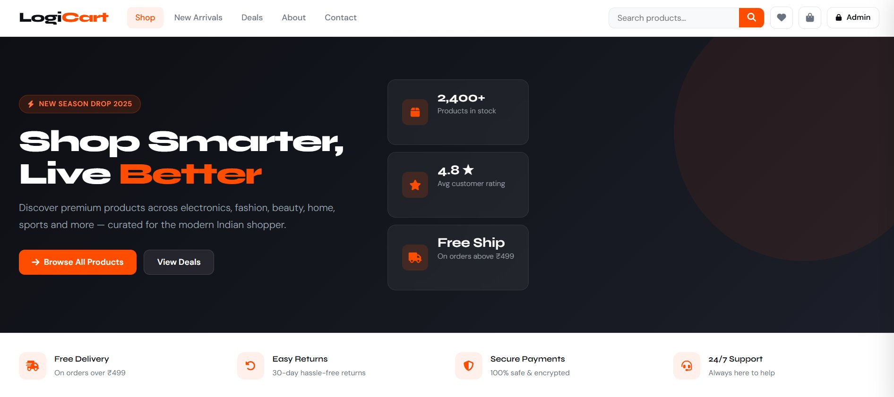
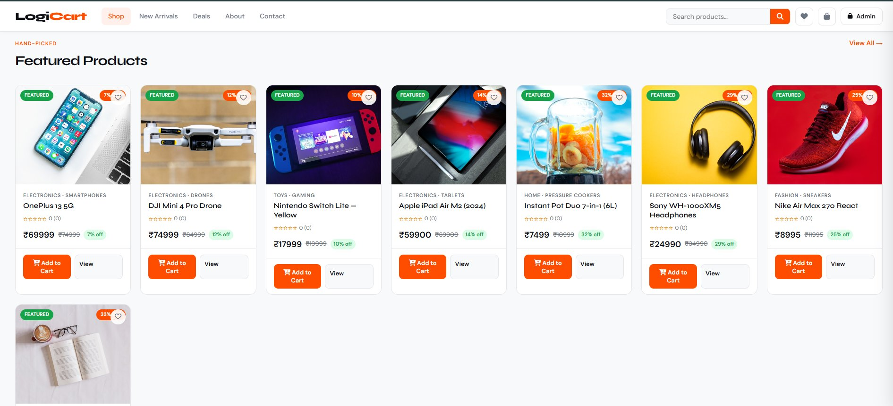
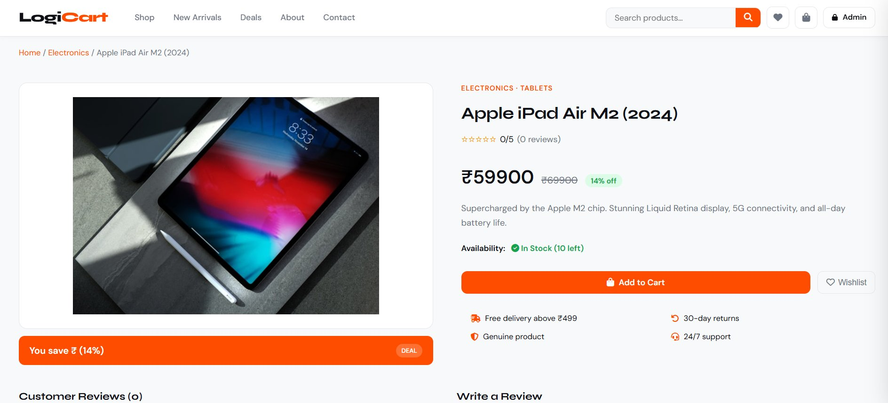
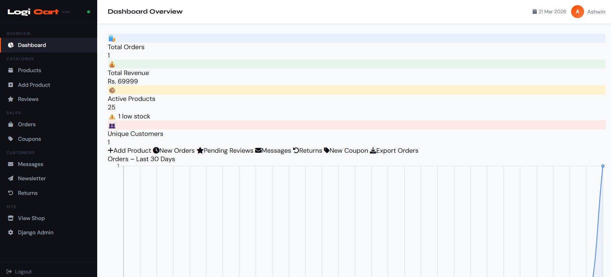

# 🛒 LogiCart

A fully redesigned Django e-commerce platform featuring a premium UI, 30 curated products, and separate shop and admin panel interfaces.

---

## 📋 Table of Contents

- [Overview](#overview)
- [Features](#features)
- [Tech Stack](#tech-stack)
- [Project Structure](#project-structure)
- [Getting Started](#getting-started)
- [Coupon Codes](#coupon-codes)
- [Pages & Routes](#pages--routes)
- [Contributing](#contributing)
- [License](#license)

---

## Overview

LogiCart is a full-featured Django e-commerce web application built for a smooth shopping experience. It includes a customer-facing shop, a custom admin dashboard, cart and wishlist management via localStorage, coupon support, and an order tracking page — all wrapped in a modern, responsive UI.

---

## ✨ Features

- **30 Products** across 7 categories: Electronics, Fashion, Beauty, Home, Sports, Books, and Toys
- **Full Shop UI** — homepage, search, product detail, checkout, order tracker, wishlist, contact, and about pages
- **Cart & Wishlist** — managed via browser `localStorage` with a slide-out cart drawer and toast notifications
- **Coupon System** — AJAX-powered coupon application at checkout
- **Newsletter Subscription** — front-end newsletter form
- **Custom Admin Dashboard** — restyled sidebar, stat cards, product tables, and an add-product form
- **Premium Typography** — Syne + DM Sans fonts with `#FF4D00` accent color
- **Clean Footer** — copyright-only footer

---

## 🛠 Tech Stack

| Layer      | Technology                  |
|------------|-----------------------------|
| Backend    | Python, Django 4.2          |
| Frontend   | HTML5, CSS3, JavaScript     |
| Styling    | Custom CSS (Syne + DM Sans) |
| Images     | Pillow                      |
| Data       | Django fixtures (JSON)      |
| Storage    | localStorage (cart/wishlist)|

---

## 📁 Project Structure

```
LogiCart/
├── Ecom/                  # Django project settings & URLs
├── dashboard/             # Custom admin dashboard app
├── shop/                  # Main e-commerce app
│   └── fixtures/
│       └── products.json  # Seed data for 30 products
├── manage.py
├── requirements.txt
├── add_images.py          # Utility: attach images to products
├── download_images.py     # Utility: download product images
└── download_images.ps1    # PowerShell version of image downloader
```
## 📸 Screenshots

### 🏠 Hero / Landing Page


### 🛍️ Featured Products


### 📦 Product Detail Page


### 🖥️ Admin Dashboard


---

## 🚀 Getting Started

### Prerequisites

- Python 3.10+
- pip

### Installation

```bash
# 1. Clone the repository
git clone https://github.com/ashwinmali7781/LogiCart.git
cd LogiCart

# 2. Create and activate a virtual environment
python -m venv venv
source venv/bin/activate        # Windows: venv\Scripts\activate

# 3. Install dependencies
pip install -r requirements.txt

# 4. Apply database migrations
python manage.py migrate

# 5. Load product seed data
python manage.py loaddata shop/fixtures/products.json

# 6. Create a superuser for the admin panel
python manage.py createsuperuser

# 7. Run the development server
python manage.py runserver
```

### Access the App

| Interface      | URL                              |
|----------------|----------------------------------|
| Shop (customer)| http://127.0.0.1:8000/shop/      |
| Admin Dashboard| http://127.0.0.1:8000/dashboard/ |
| Django Admin   | http://127.0.0.1:8000/admin/     |

---

## 🏷 Coupon Codes

Add these via the Django Admin panel to enable discounts at checkout:

| Code       | Discount         |
|------------|------------------|
| `LOGI30`   | 30% off          |
| `FLAT100`  | Flat ₹100 off    |
| `NEWUSER`  | 20% off          |

---

## 🗺 Pages & Routes

| Page            | Description                              |
|-----------------|------------------------------------------|
| `/shop/`        | Homepage with featured products          |
| `/shop/search/` | Search products by name or category      |
| `/shop/<id>/`   | Product detail page                      |
| `/shop/checkout/`| Cart review and coupon application      |
| `/shop/tracker/`| Order tracking page                      |
| `/shop/wishlist/`| Saved / wishlisted products             |
| `/shop/contact/`| Contact form                             |
| `/shop/about/`  | About page                               |
| `/dashboard/`   | Admin dashboard (stat cards, tables)     |

---

## 🤝 Contributing

Contributions, issues, and feature requests are welcome!

1. Fork the repository
2. Create your feature branch: `git checkout -b feature/your-feature`
3. Commit your changes: `git commit -m 'Add your feature'`
4. Push to the branch: `git push origin feature/your-feature`
5. Open a Pull Request

---

## 📄 License

This project is open-source. Feel free to use, modify, and distribute it.

---

> Built with Django 🐍 | Designed for a premium shopping experience 🛍️
